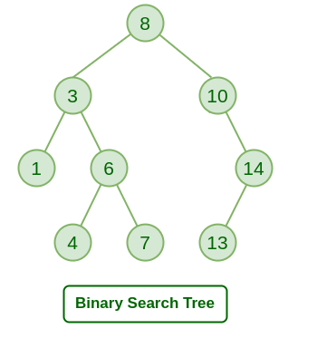

#### 一,  二叉排序树删除节点思路

第一种情况：删除的是叶子节点

步骤：

1. 首先找到这个节点；
2. 判断是否是叶子节点。
   是叶子节点的话分为两种情况：
   - 二叉树只有一个根节点，它同时也是一个叶子节点，此时暂时不删除(实际程序处理时优先判断此情况)。
   - 一般的叶子节点；
3. 获取叶子节点的父节点，然后判断叶子节点是其左节点还是右节点，确定后即可进行删除。

