## 概述

算法实际类似一种解题方法，一步步把问题解决，只是有的解题方法比较快，有的比较慢且笨，这就体现了算法的优略。


## 一，数据结构

### 1 ，数组环形队列实现思路

- 数组模拟环形队列实际就是当数组前面为空时，可把rear指针从数组最后面接着沿着环形移到数组最前面，继续添加数据。

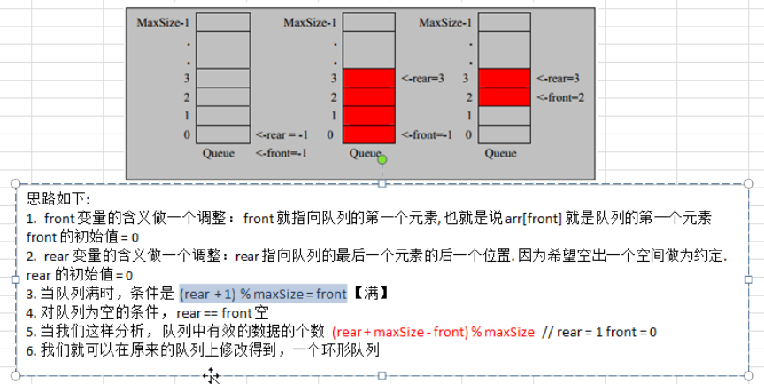

- 数组中有一个空的位置原因是老师的思路是想留一个空间给rear指向，增加可读性，也可不设置空位置

### 2，链表

- 链表在内存中不一定是连续的，每个节点有一个地址指向下一个节点；
- 整个链表的内存地址和链表的第一个元素的内存地址相同；
- 链表内最后一个元素的next指针为null, 因为后面没元素了；

### 3，栈

1）用数组模拟栈的操作，遵循先入后出，后入先出的原则

作业：用链表实现栈的操作。

### 4，用栈做计算器的思路

以6+3*5-2为例，因为运算符有运算顺序，先算乘除后算加减，所以用两个栈，一个放数，一个放运算符

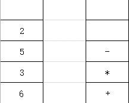

**思路：**

1. 从前向后扫描运算式，扫描到的数直接放入数栈，

2. 扫描到的运算符要进行判断，

   如果当前运算符栈为空则直接入栈；

   如果扫描到的运算符的优先级小于或者等于栈顶的操作符，则弹出数栈中栈顶的两个数，再弹出运算栈顶的运算符进行运算，然后把结果存入数栈，运算符直接弹栈(此操作目的是让优先级高的运算符先算)。注意数栈中两个数的运算顺序。

   如果扫描到的运算符优先级大于栈顶的符号，则直接入栈。

3. 扫描完毕后，把栈中的数按顺序和运算符进行运算，注意栈底的数在运算符前面（即把后弹出的数作为被减数，或被除的数，加和乘的话两个数的运算顺序没影响）。最后在栈底只留一个数就是运算结果。

先按上述表达式模拟下，体会这种思路。

### 5，中缀，前缀，后缀表达式

* 中缀表达式：运算符在中间的运算式，例，3+4，符合人的运算习惯
* 前缀表达式：运算符在前面 + 3 4
* 后缀表达式：运算符在后面 3 4 + (也称逆波兰表达式)

**注意：在实际开发中一般把中缀表达式转为后缀表达式**

**Reverse Polish  Notation (RPN)  逆波兰表达式**：这种表达式更适用于计算机的计算，可使用堆栈数据结构十分适合这种方式的运算，并且减少了内存的访问，而且整个运算式不用加括号。中缀表达式一般先计算哪部分都加括号表示，不加括号则按运算符的优先级。而逆波兰表达式不用括号就可以实现这种效果，它可根据规则自动按运算符的优先级计算。

逆波兰表达式的运算规则：以 6 + 2 * 3 - 4为例转换为逆波兰表达式就是 6 2 3 * + 4 -，从左只有扫描，遇到运算符则把运算符左边的两个数按运算符计算，再把运算结果放回原位，去除使用过的运算符。

例：中缀：3 - 4 * 5   转换为后缀表达式是： 3 4 5 * -

​       中缀：  (3 - 4) * 5  则是 ：  3 4 - 5 *，

 由此可见逆波兰表达式无歧义的实现了无论是带括号或不带括号中缀表达式的转换。

### 6，递归

使用递归注意事项

一定要有一个条件终止递归，否则会造成内存泄漏；

写递归代码思路总结：

1，首先递归是跟栈的特性是一样的，最后被调用的方法，最先执行，因此根据这个特点一定加好判断条件看最后一个方法什么情况下弹栈

2，最后一个方法执行完后所有语句后才会弹栈，思路模拟时从最后一个弹栈开始。例：

```java
	descendPrint(123456);
	//正序打印，利用递归，栈的特点(LIFO)
	public static void descendPrint(int number){
		//这里就是判断当参数小于等于9时，递归的最后一个方法打印完数组，return,弹栈，后续的所有方法持续弹栈
        if(number <= 9){
			System.out.println("descend==>" + number);
			return;
		}
		descendPrint(number / 10);
		System.out.println("descend==>" + number % 10);
	}
```


**1）迷宫回溯出现的问题：**

个人初步代码RecursionTest中实现了迷宫，但如果走不到指定的终点就不会反馈结果，即没有把走不通的路设置成“3”，没有利用到递归的“后进先出”的特性，即没有利用回溯。

**2）八皇后问题：**

规则：在8x8的棋盘上，放置8个皇后，使其不能互相攻击，即任意两个皇后都不能在同一行，同一列或统一对角斜线上。

- 解题时也用到了递归回溯，当到第n个皇后时，要检查之前n-1行的是否符合要求，不符合的话在从0到n行重新摆放，直到从0到n这几个皇后都不能互相攻击。
- 第一个皇后放第一行第一列时，就先压栈，至放第八个皇后，放这第八个时会从第一个检查，如果不符合要求，第一个会放第二列。
- 一次for循环，就执行一次递归；
- 如果到最后一个第八个皇后，检查之前的七行里的都可以攻击，则递归到头，开始弹栈，一直弹到调用递归哪一行，注意不一定是第一行，有可能是第二行第三列，不合格就循环到第二行第四列在递归；

结合程序注释理解。

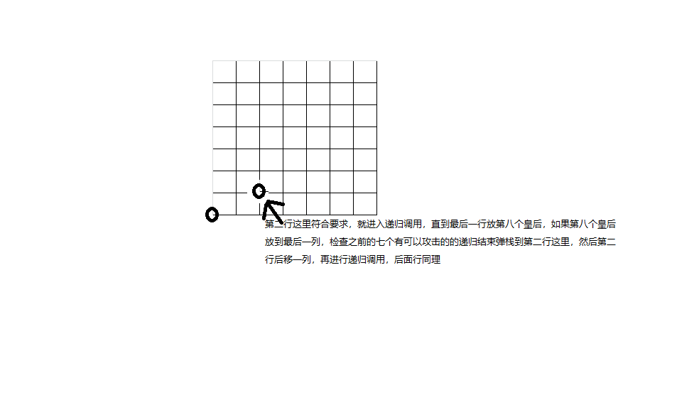

### 7，哈希表，HashTable

- 哈希表也称散列表，实际是由链表组成的数组，添加时根据添加节点的指定编号，通过散列函数来确定放到哪个下标位置的链表里，然后再添加到链表中。查找时也是先确定在数组中哪个位置，然后在这个位置上的链表里找。
- 哈希表也可当作简单的缓存使用，功能不如Redis等缓存产品，但是比较简洁，也是把数据存到内存里的，访问速度比较快。

示意图：

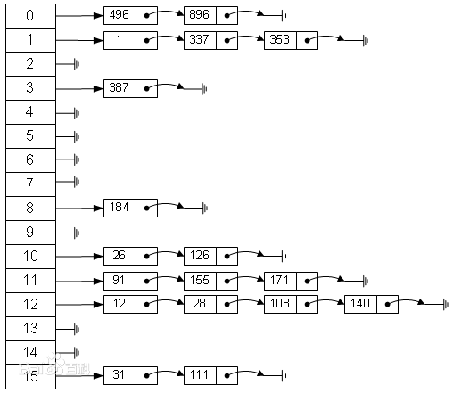

### 8，二叉树

**1，什么是二叉树？**

 二叉树（binary tree）是指树中节点的度不大于2的有序树 。

二叉树的类型

- 普通二叉树，没有任何父子节点的要求
- 满二叉树(Full Binary Tree) : 所有节点要么没有子节点，要么有两个，称为满二叉树
  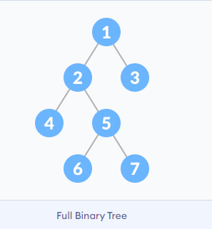

- 完全二叉树(Complete Binary Tree): 最下层如果有叶子节点，那必须是左叶子节点（下图 6号），倒数第二层如果有叶子节点那只能是右叶子节点（3号节点）（就是满二叉树最下层去掉一个右叶子节点）。完全二叉树包括满二叉树。

  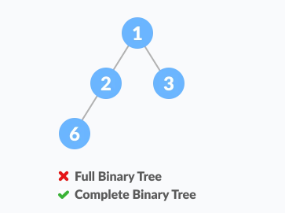

**2，二叉树相关名词？**

根节点：root

父节点： parent node

中间节点(internal node): 指有父节点，也有子节点的节点。

叶子节点(leaf->pl. leaves): 末端的没有子节点的节点.


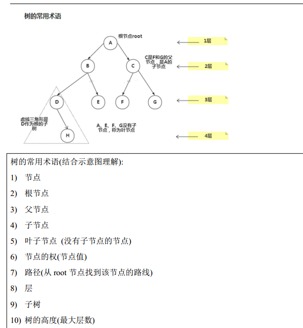

**3，遍历方法的区别？**

- 前序遍历：顺序是“根左右"，即先遍历根节点，再遍历左子树节点，再遍历右子树节点。 

​					图例前序遍历，{A,B,D,E,C,F,G}.		

- 中序遍历：顺序是“左根右”， 即先遍历左子树节点，再遍历根节点，再遍历右子树节点。 

​					图例中序遍历，{D,B,E,A,F,C,G}

- 后序遍历：顺序是“左右根" ，即先遍历左子树节点，再遍历右子树节点，再遍历根节点。

​					图例后序遍历，{D,E,B,F,G,C,A}

- 注意遍历的思路：以上所有遍历都是先找到最下层的叶子节点， 即先找到子树，再按上述指定顺序规则遍历，遍历完之后再往上走继续按规则遍历。

  例，中序遍历，先找A的左节点，左节点不是叶子节点，则继续向左找，找到D是叶子节点，就开始按“左中右”顺序遍历，完成后在回到B，这时B是A的左节点再按这个顺序遍历，到右节点C的时候发现还有子节点，就继续向下一直找到叶子节点，再按规则遍历得到{D,B,E,A,F,C,G}。其他遍历方法同理。
  
  ​     前序遍历是，先打印root节点A，在向左遍历，找到是父节点的就打印，如果不是父节点而是左叶子节点也打印

例：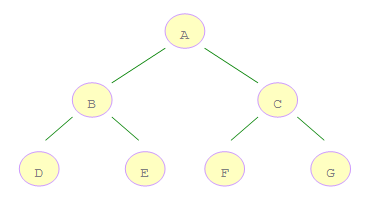

参考：https://blog.csdn.net/u010414589/article/details/115415226

**4，顺序存储二叉树

指把一个数组当成二叉树一样进行前序，中序或后序遍历。用途：堆排序的时候会用到此方法。


顺序二叉树通常针对的是完全二叉树;

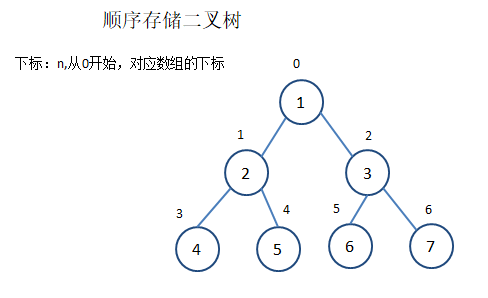

**5,  公式（适用于任何二叉树）：**

n：最后一个节点的下标，arr.length : 线索化后数组长度，也是二叉树节点的个数。

**(1) 中间节点个数**:  (n-1)/2 或者arr.length/2 - 1 :   同时也是最后一个中间节点的下标。
   使用 arr.length = n + 1，公式换算后和前面的公式相同。

**(2)父节点和左右子树下标之间的关系:**（下标为n，从0开始，对应数组的下标）：
1，父节点的下标为 i，则其左节点的下标为：2 x i + 1;
2，其右节点的下标为：2 x i + 2;


**6，线索化二叉树**

1) 什么是线索化二叉树？

- 在一个二叉树中，叶子节点或者只有一个子节点的的父节点，它们中的left,right的引用是null，没有被充分利用。
  把这些节点利用起来，让他们指向前驱或后继节点即称为线索化二叉树。这些附加的引用成为“线索”。

- n个节点的二叉树中含有n + 1个空指针。
  推导思路：以满二叉树来推导，减一个叶子节点后实际只减去了一个null，因此n-1个节点的公式是(n-1)+1，还是符合n+1这个公式。

- **注意：**线索化二叉树指把所有的节点都线索化了，不只是左右节点为null的叶子节点。

2) 相关概念

- 加上线索的的二叉链表成为线索链表，相应的二叉树称为线索二叉树。
  根据线索性质的不同，线索二叉树前/中/后序二叉树三种，实际就是按照遍历顺序在有些节点的left, right空值里加上对应的前后节点的引用。例如：在上图的二叉树，按前序遍历的话是{1，2，4，5，3，6，7}，4节点的前驱节点为2，则在其left中赋值2节点的引用，后继节点是5，则把4的right赋值为5的引用。

3) 二叉树如果线索化后出现的问题

- 使用原来的递归遍历方式会有问题，应采用新的方式，利用前驱后继节点来遍历二叉树，而且这种方式比原来的递归方式效率高。

### 9，BST

BST: Binary Search/Sort Tree: 二叉搜索树

定义？

二叉搜索树指中间节点，即父节点的值小于其左子树及左子树的所有子节点，大于其右子树及右子树的所有子节点。

简要概况及时间复杂度，空间复杂度：

```txt
    Binary search tree
Type	tree
Invented	1960
Invented by	P.F. Windley, A.D. Booth, A.J.T. Colin, and T.N. Hibbard
Time complexity in big O notation
Operation	Average	 Worst case
Search	   O(log n)	  O(n)
Insert	   O(log n)	  O(n)
Delete	   O(log n)	  O(n)
	Space complexity
Space	   O(n)	      O(n)
```

为什么用二叉树？有什么优点？

二叉树的查找等同于二分查找算法，在平均情况下的时间复杂度是$O(log_2n)$，即根节点的值属于整个树里节点值的中间部分时，最差时间复杂度是$O(n)$, 跟链表类似，即所有节点都在根节点的一侧。

时间复杂度跟树的深度有关系，对于满二叉树来说，从上到下的节点依次是1，2，4，8。可知$log_2n$约等于树的深度。

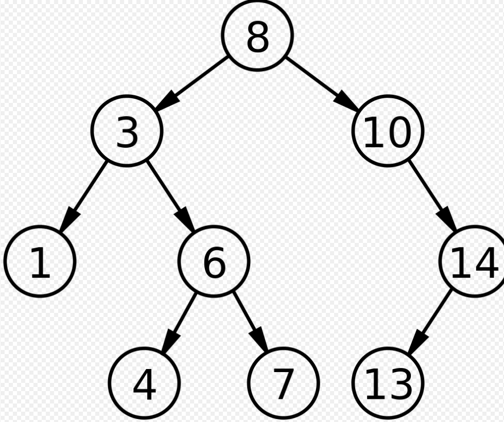


## 二，算法

#### 学习算法的方法

- 首先把复杂的算法拆解成简单的步骤。从最简单的步骤做起，先写手动一步步的步骤，然后再加for或者while循环自动完成。
- 一定要画图把思路理清楚，才做，不要上来就试着写，写不对。

### 1，时间频度

用T(n)表示。

### 2，常见的时间复杂度

时间复杂度用O(n)表示。一般说时间复杂度指的是最坏情况下的时间复杂度，因为不可能出现比最坏情况下时间还慢的情况。

以下的从上到下时间复杂度递增。

(1)常数阶：O(1)，这种复杂度不随变量的变化而变化。例:

```java
int i = 10;
public void doSome(){
    int j = i + 1;
}   
```

(2)对数阶: $O(log_2n),O(log_3n)$ ,  底数可以是2，也可以是其他自然数。

例：2的x次方小于n，表示循环x次之后可得到结果。

```java
int i = 1;
while(i < n){
    i *= 2;
}
```

(3)线性阶: O(n)， 例：复杂度由n来决定的。

```java
for(int i = 0; i < n; i++){
    System.out.println();
}
```

(4)线性对数阶：指的是线性阶和对数阶相乘。
$$
O(nlog_2n)
$$
例：在for循环里嵌套对数阶的while循环

```java
int j = 1;
for(int i = 0; i < n; i++){
    while(j < n){
        j *= 2;
    }
}
```

(5)平方阶
$$
O(n^2)
$$
例：两层for循环，每层循环n次

```java
for(int i = 0; i < n: i++){
    for(int j = 0; j < n; j++){
        
    }
}
```

(6)立方阶: 跟平方阶同理，三层for循环，每层循环n次
$$
O(n^3)
$$
(7)k次方阶： 也跟平方阶同i，k层for循环，每层循环n次
$$
O(n^k)
$$
(8)指数阶：时间复杂度最大，尽量不要在程序中使用
$$
O(k^n)
$$
例：随着n的增大，程序运行的次数呈指数级上升。

```java
public long sum(int n){
    if(n <= 1){
        return 1;
    }
    return sum(n - 1) + sum(n - 2);
}
```

 (9)阶乘： O(n!)

### 3，空间复杂度

指程序算法所耗费的存储空间。

一般用空间换时间，提高程序运行效率。Redis, memecache等用的就是次策略。

### 4，排序算法

#### 1) 排序分为内部排序算法和外部排序算法

​	(1)内部排序：指把所有数据拿到内存中进行排序。

​    **内部排序共八种：**

​	冒泡排序，选择排序(Select Sort)。 （属于交换排序类型）

​	直接插入排序(Insert Sort)，希尔排序(Shell Sort，对直接排序进行了优化)。 （插入排序类型）	

​	简单选择排序，堆排序。（选择排序大类型）

​	归并排序。  

​	基数排序。	

​	(2)外部排序：使用内存和硬盘空间结合的方式进行排序，用于较大的数据。

#### 2) 内部排序

##### 2.1 Shell Sort 希尔排序

思路分析图，结合代码笔记理解。

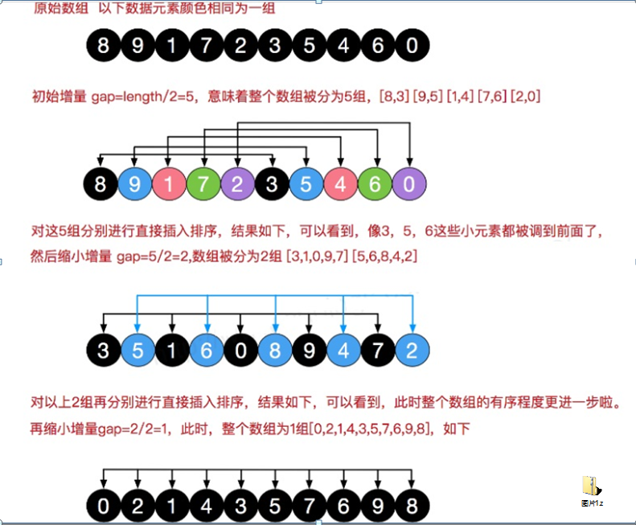

##### 2.2 QuickSort快速排序

最大时间复杂度$O(n^2)$

平均时间复杂度$nO(log_2n)$

##### 2.3 MergeSort 归并排序

最大，平均，最优时间复杂度都是$nO(log_2n)$，属于对数阶，速度很快。

思路：

该算法采用分治策略，先把数组拆分成最小的单位，然后再合并，分而治之。

用到到了递归类进行分的实现。

思路图：

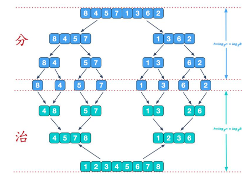


- 当分到只有一个元素时，就进行比较，递归到最后时弹栈就执行比较后排序的方法，例，先比较8(index:0)和4(index:1)，比较完放到临时数组，然后再放回原数组的下标里。

- 1，1排序合并-->2,2排序合并-->直到最后。关键注意体会递归的特性，理解最后弹栈的用法和原理。

合并思路图，这是最后一次合并的示意图。

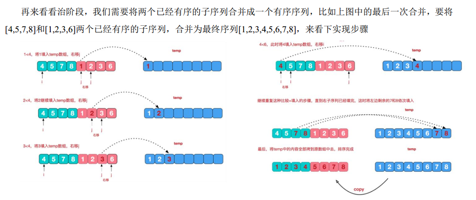

##### 2.4 基数排序(Radix Sort)

基数排序时间复杂度$O(n*k)$。n：数据规模，k：”桶“的个数。注：计数排序和桶排序跟基数排序类似。

1. 基数排序属于“分配式排序”，也称桶排序。它属于效率较高的有“稳定性“的排序，”稳定性“指如果原数组中arr[i] >arr[j] 而且arr[i]在arr[j]之前，那在排序的过程中他们的相对位置一直保持不变，此称作”稳定性“。

2. 基数排序实质使用空间复杂度换取时间复杂度，占用内存较大，使用时注意。

3. 个人整理思路如下：

   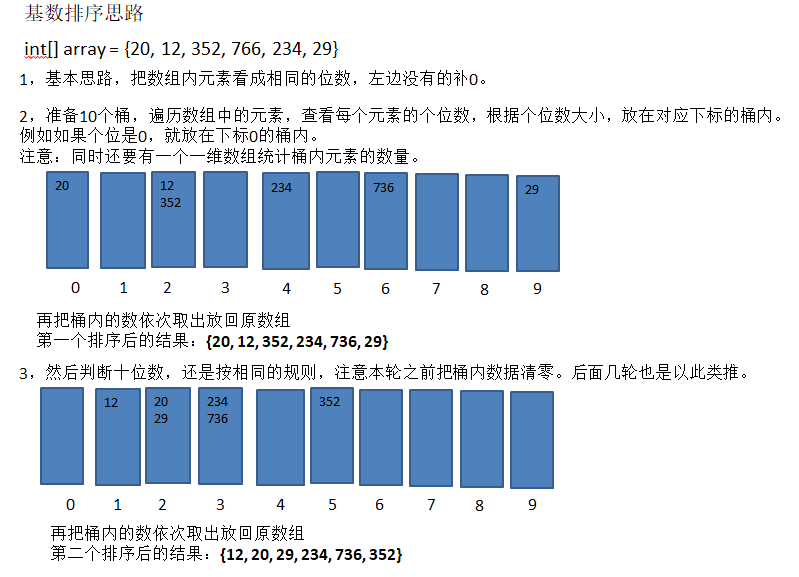

3）几种排序算法的比较

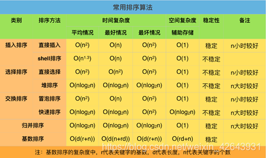

#### 5，查找算法

1) 线性查找法

2) 二分查找法

3) 插值查找法

4) 斐波那契查找算法

斐波那契查找算法也称黄金分割查找法，斐波那契数列的元素数值之比无限接近于黄金比例0.618。

斐波那契查找算法在插值查找算法的基础上对mid的值的算法进行了优化，使之符合黄金比例。

注意，使用时有时候数组不够长找不到黄金分割点，需要扩容数组。

思路：

例，原数组{1，2，3，4，5，6，7，8，9，10，11，12，13，14，15}

1，由斐波那契数列{0,1,1,2,3,5,8,13,21,43.....}，可知arr[k] = arr[k-1] + arr[k-2]。数列内相邻元素之比接近于0.618这个黄金分割点。越往后越接近。

​	由arr[k] = arr[k-1] + arr[k-2]  可得 arr[k] - 1 = （arr[k-1]  - 1) + (arr[k-2] -1) + 1，之所以换成这样的公式是因为数组下标从0开始，这样更好转化，例 arr[6] = arr[5] + arr[4]==> 13=8+5 ==> 13-1= (8-1) + (5-1) + 1,前面8-1是黄金分割点的下标，后面 (5-1) + 1是另一段。即可得mid = begin + arr[k-1]  - 1

2,  原数组的长度按斐波那契数列公式进行分割，即可得到接近黄金分割点的位置，类似于原来插值查找法的mid，实际这个mid并不是中间下标，而是原数组按斐波那契公式找到的接近黄金分割点的地方。

例，原数组长度，我们就找斐波那契数列中的“8, 13”，然后8+13=21 >15，斐波那契数列值的综合大于原数组长度的话需要扩容原数组，扩容的值就等于原数组的最后一个元素值(因为是递增数组)。这样第一次分割就能按8:13找分割点了。

​    第二次分割在从斐波那契数列中往前找。

3, 实际原理跟插值查找法类似，只是把这个比例换成了斐波那契数列中相邻两个元素的前后比值而已。

## 三，其他

### 1，数组，链表，树比较

- 数组查询效率较高，根据下标可直接定位。但是当数组容量不够扩容，或者添加删除元素时，数组会整体移动，这样效率就很低了。ArrayList底层就是数组Object[]。

- 链表查询效率低，因为需要从头开始遍历，但是添加和删除效率高，因为链表内的数据靠节点内的引用指针等链接，添加删除操作只需修改指针就行了。

- 而树这种数据结构结合了上面两种结构的有点，摒弃了它们的确定，是一种比较优化的数据结构。例如，在二叉排序树内查找的速度和二分查找法原理类似，都是二等分，时间复杂度$O(log_2n)$ 


## 总结：

1，数据结构和算法抽空多复习

2，线索化二叉树多复习