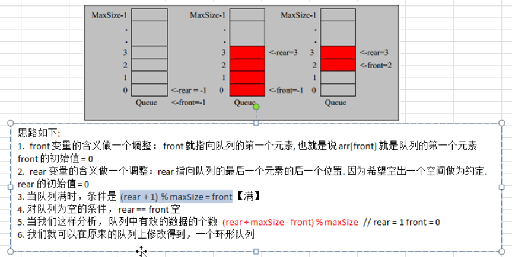

## 一，数据结构

### 1 ，数组环形队列实现思路

- 数组模拟环形队列实际就是当数组前面为空时，可把rear指针从数组最后面接着沿着环形移到数组最前面，继续添加数据。

- 数组中有一个空的位置原因是老师的思路是想留一个空间给rear指向，增加可读性，也可不设置空位置

### 2，链表

- 链表在内存中不一定是连续的，每个节点有一个地址指向下一个节点；
- 整个链表的内存地址和链表的第一个元素的内存地址相同；
- 链表内最后一个元素的next指针为null, 因为后面没元素了；

### 3，栈

1）用数组模拟栈的操作，遵循先入后出，后入先出的原则

作业：用链表实现栈的操作。

